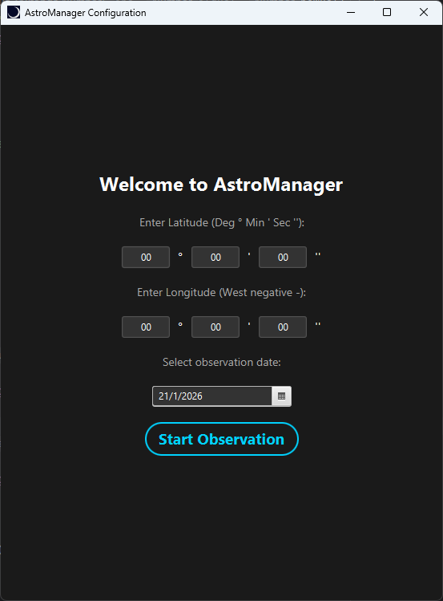
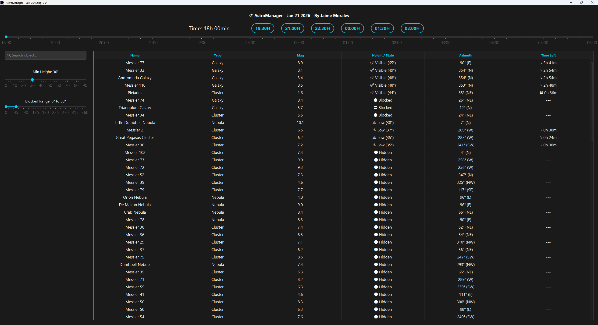

# 🔭 AstroManager
### v1.0 by Jaime Morales

---

## Overview
**AstroManager** is a specialized desktop application designed for astronomical observation and imaging planning.
It calculates the real-time position (**Altitude and Azimuth**) and visibility of
deep-sky objects based on the user's exact coordinates and day of the year.

Unlike simple star charts, AstroManager utilizes high-precision astronomical algorithms
(**Jean Meeus / Epoch J2000**) to provide data comparable to professional software like
Stellarium.

It provides essential data such as Name, ID, Magnitude, Visibility State, and a precise countdown ("Time Left") for the object to set or be blocked.

This project is a presonal project made by Jaime Morales 

---

## About updates
For now, the table contains all the Messier catalogue. I am currently working on adding the NGC catalogue, but it will
take me a couple of days since there are thousands of objects.

Eventually, I am planning on adding the Solar System planets, but since they need special position calculations they are not included
yet.

---

## Features

* **Real-Time Catalog:** Visualize celestial objects from the Messier catalog with live position updates.
* **Custom Horizons:** Set a **minimum altitude** to define when an object is useful for you.
* **Obstacle Simulation:** Define a **blocked azimuth range** (e.g., a building or mountain), and the app will calculate if objects are hidden behind it.
* **Interactive Planning:** Use sliders to simulate future times and see how visibility evolves throughout the night.
* **Smart Search:** Instantly filter objects by Name or ID (e.g., "M31", "Orion").

---

## Screenshots

| Configuration | Observation Panel |
|:---:|:---:|
|  |  |

---

## Technical Stack

* **Language:** Java 23.
* **UI Framework:** JavaFX 23 (Stage, Scene) & **ControlsFX** (Range Components).
* **Styling:** CSS3 (Custom "Deep Space" Dark Theme).
* **Data:** CSV Parsing (Custom Loader).
* **Algorithms:** Spherical Trigonometry, Julian Date Conversion & GMST/LST Calculation.

---

## How it Works (The Core)

The engine of the application is the `AstroCalculator` class, which performs complex coordinate transformations in real-time:

1.  **Date Conversion:** Converts Gregorian dates to **Julian Days (JD)**.
2.  **Sidereal Time:** Calculates GMST (*Greenwich Mean Sidereal Time*) and adjusts it to local Longitude to get **LST**.
3.  **Coordinate Transformation:** Converts fixed Equatorial Coordinates (Right Ascension / Declination) into local **Horizontal Coordinates (Altitude / Azimuth)** using the observer's Latitude.

---

## Roadmap
* [x] Messier Catalog (110 Objects)
* [ ] NGC Catalog (New General Catalogue)
* [ ] Solar System Planets (Requires Keplerian orbital elements implementation)
* [ ] Save user location preferences

---

# ⚠️ Disclaimer
**AstroManager** is a personal project created by **Jaime Morales**.
Feel free to explore the code for educational purposes!
#
#
#
#
